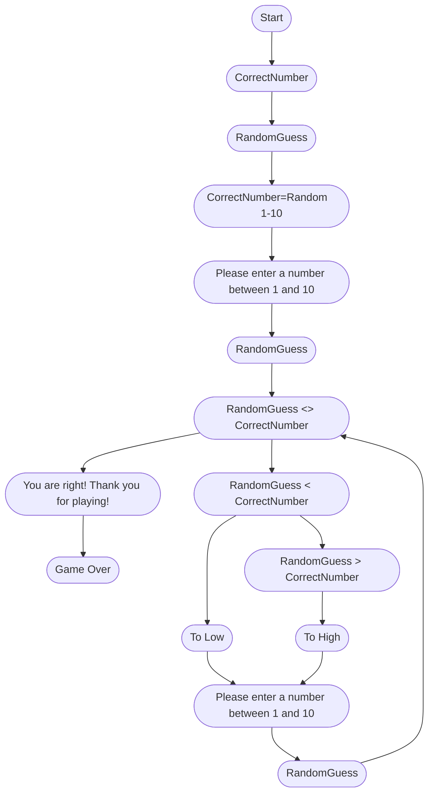

The first step is for the computer to pick a correct number. The next step is for the user to guess a number. The third step is for the computer to say "Please enter a number between 1 and 10." Then the user will guess a number and if the number is correct the 
computer will say, "You are right thank you for playing." But if the guess was smaller than the correct number the computer will say, "To low" and "Please enter a number between 1 and 10." If the users guess was greater than the correct answer the computer will say, 
"To High" and "Please enter a number between 1 and 10." The user will then continue to enter numbers until they finally guess the correct number and they will receieve the message "You are right. Thank you for playing."

